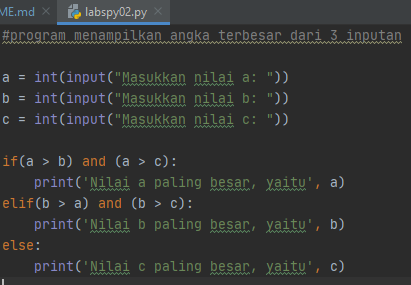
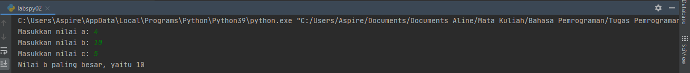

# PERTEMUAN 7
### NAMA: INDIRA ALINE
### KELAS: TI. 20. A. 1
### NIM: 312010042
___________________________________________________________________________________

# TUGAS PRAKTIKUM 2

## SOAL

 <br>

## JAWABAN
  - Buka text editor, seperti PyCharm, Visual Studio, Atom, dan lain-lain.
  - Kemudian salin kode berikut ini
  

```python
        1   #program menampilkan angka terbesar dari 3 inputan
        2
        3   a = int(input("Masukkan nilai a: "))
        4   b = int(input("Masukkan nilai b: "))
        5   c = int(input("Masukkan nilai c: "))
        6
        7   if(a > b) and (a > c):
        8       print('Nilai a paling besar, yaitu', a)
        9   elif(b > a) and (b > c):
        10      print('Nilai b paling besar, yaitu', b)
        11  else:
        12      print('Nilai c paling besar, yaitu', c)
        13

```
  
 <br>

- Simpan dengan nama `labspy02.py`, Kemudian jalankan program tersebut. Maka akan menampilkan output sebagai berikut

 <br>
  