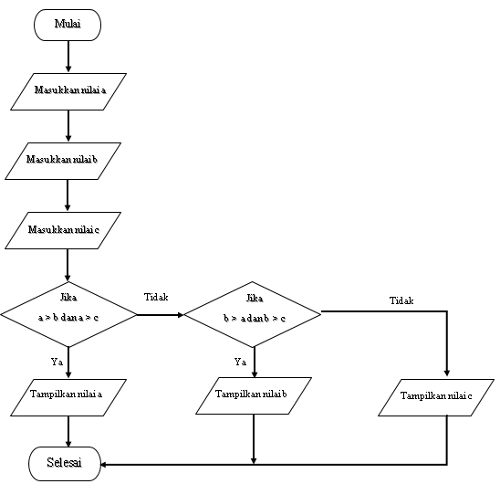

# PERTEMUAN 7
### NAMA: INDIRA ALINE
### KELAS: TI. 20. A. 1
### NIM: 312010042
___________________________________________________________________________________

# TUGAS PRAKTIKUM 2

## SOAL

 <br>

## JAWABAN
  - Buka text editor, seperti PyCharm, Visual Studio, Atom, dan lain-lain.
  - Kemudian salin kode berikut ini
  

```python
        1   #program menampilkan angka terbesar dari 3 inputan
        2
        3   a = int(input("Masukkan nilai a: "))
        4   b = int(input("Masukkan nilai b: "))
        5   c = int(input("Masukkan nilai c: "))
        6
        7   if(a > b) and (a > c):
        8       print('Nilai a paling besar, yaitu', a)
        9   elif(b > a) and (b > c):
        10      print('Nilai b paling besar, yaitu', b)
        11  else:
        12      print('Nilai c paling besar, yaitu', c)
        13

```
  
 <br>

- Simpan dengan nama `labspy02.py`, Kemudian jalankan program tersebut. Maka akan menampilkan output sebagai berikut

 <br>

- Flowchart dari program tersebut

 <br>

## PENJELASAN
  - Pada baris ke-3, menginstruksikan kita untuk memasukkan nilai **a**, kemudian akan disimpan dalam variabel `a` dalam bentuk integer.

  - Pada baris ke-4, menginstruksikan kita untuk memasukkan nilai **b**, kemudian akan disimpan dalam variabel `b` dalam bentuk integer.

  - Pada baris ke-5, menginstruksikan kita untuk memasukkan nilai **c**, kemudian akan disimpan dalam variabel `c` dalam bentuk integer.

  - Di baris ke-7, ada klausa `if` untuk pilihan kondisi pertama, dan `and` merupakan operasi logika, hasilnya adalah _True_ jika kedua operatornya bernilai benar. Misalnya

    - `a=4`,`b=10`,`c=5`, _"Jika nilai `a` lebih besar dari `b`"_ **(ini benar)**, dan _"Jika nilai `a` lebih besar dari `c`"_ **(ini benar)**. Maka program berlanjut ke baris-8, _cetak nilai `a` ke layar_.
    
 <br>
  